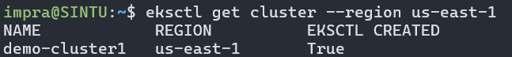
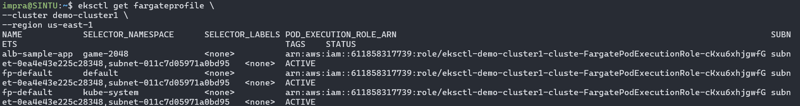
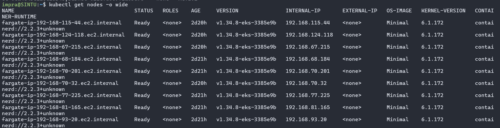
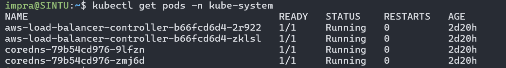
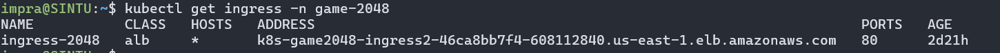
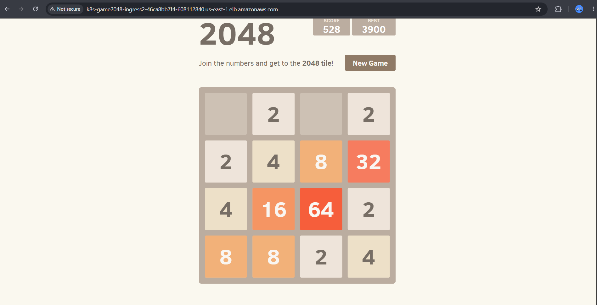

# eks-fargate-alb-2048-app-deployment
Hands-on DevOps project: Amazon EKS, AWS Fargate, ALB Ingress Controller, Kubernetes, Helm, IAM, and application deployment.
# Amazon EKS Fargate Deployment with AWS Load Balancer Controller

## Project Overview

This project demonstrates deploying a Kubernetes application on Amazon EKS using AWS Fargate and exposing it through an AWS Application Load Balancer (ALB).

## Architecture

User → AWS ALB → Kubernetes Ingress → Service → Deployment → Pods running on AWS Fargate

## Technologies Used

* Amazon EKS
* AWS Fargate
* Kubernetes
* kubectl
* eksctl
* Helm
* AWS Load Balancer Controller
* IAM Roles for Service Accounts (IRSA)

## EKS Cluster

## Fargate Profiles

## Fargate Nodes

## AWS Load Balancer Controller

## Ingress

## Application

## Learning Outcomes

* Amazon EKS Administration
* AWS Fargate
* Kubernetes Networking
* ALB Ingress Configuration
* IAM Roles for Service Accounts
* Troubleshooting Kubernetes Workloads
